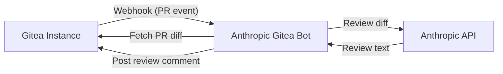
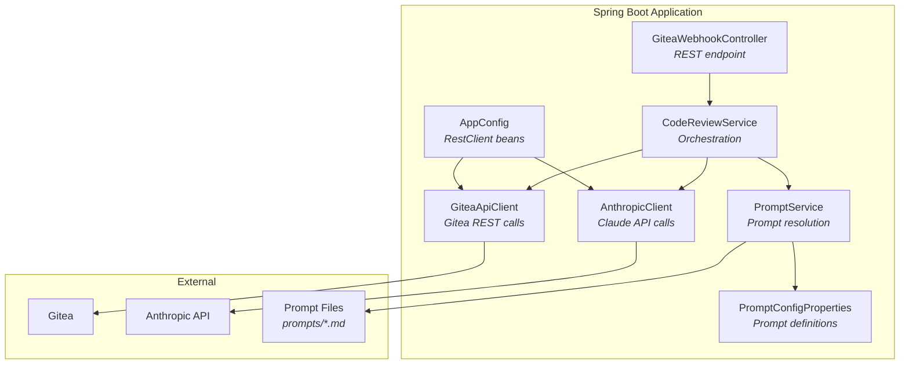
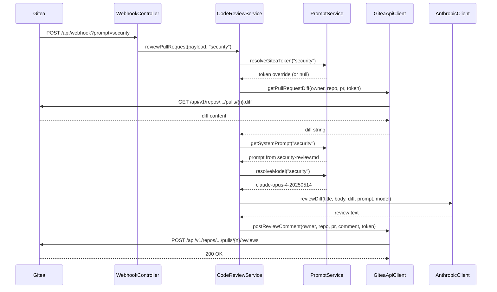
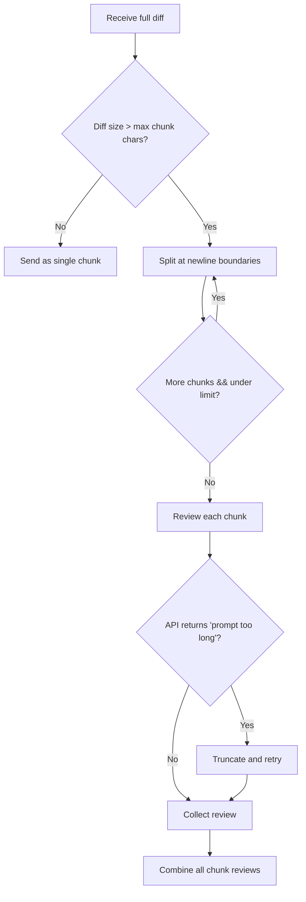
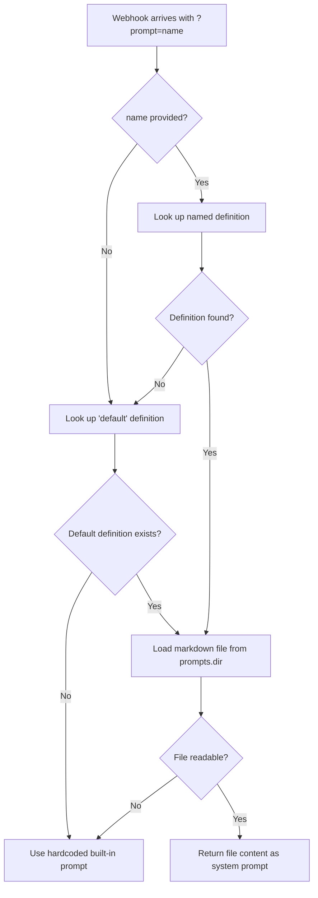
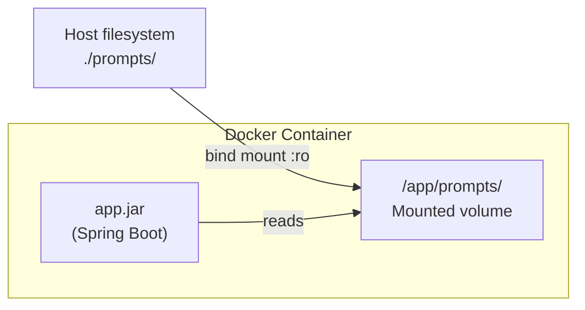

# Architecture

This document describes the high-level architecture of the Anthropic Gitea Bot, including component responsibilities and request flows.

## System Overview

The bot sits between a Gitea instance and the Anthropic Claude API. When a pull request is opened or updated, Gitea sends a webhook to the bot. The bot fetches the diff, sends it to Claude for review, and posts the review back as a PR comment.

## Component Diagram

## Components

### GiteaWebhookController

- **Package:** `org.remus.giteabot.gitea`
- **Endpoint:** `POST /api/webhook?prompt={name}`
- Receives Gitea webhook payloads for pull request events
- Filters for `opened` and `synchronized` actions only
- Accepts an optional `prompt` query parameter to select a review profile
- Delegates to `CodeReviewService` asynchronously

### CodeReviewService

- **Package:** `org.remus.giteabot.review`
- Orchestrates the full review flow:
  1. Resolves prompt configuration (system prompt, model override, token override)
  2. Fetches the PR diff from Gitea
  3. Sends the diff to Claude for review
  4. Posts the review comment back to the PR
- Runs asynchronously via `@Async`

### PromptService

- **Package:** `org.remus.giteabot.config`
- Resolves named prompt definitions from configuration
- Loads system prompt content from markdown files on disk
- Falls back to the `default` definition, then to a hardcoded built-in prompt
- Resolves per-prompt model and Gitea token overrides

### AnthropicClient

- **Package:** `org.remus.giteabot.anthropic`
- Sends review requests to the Anthropic Messages API
- Handles large diffs by splitting them into chunks
- Retries with truncated input when prompts exceed model limits
- Supports system prompt and model overrides per request

### GiteaApiClient

- **Package:** `org.remus.giteabot.gitea`
- Fetches PR diffs from the Gitea API
- Posts review comments back to PRs
- Supports per-request token overrides with cached `RestClient` instances

### AppConfig

- **Package:** `org.remus.giteabot.config`
- Configures `RestClient` beans for Gitea and Anthropic API communication

### PromptConfigProperties

- **Package:** `org.remus.giteabot.config`
- Maps `prompts.*` configuration properties to named `PromptConfig` definitions
- Each definition specifies a markdown file and optional model/token overrides

## Request Flow

## Diff Chunking Flow

## Prompt Resolution Flow

## Docker Deployment

- The `prompts/` directory is baked into the image with a default prompt
- At runtime, the host's `./prompts/` directory is bind-mounted as read-only
- Prompt files can be edited on the host without rebuilding the image
