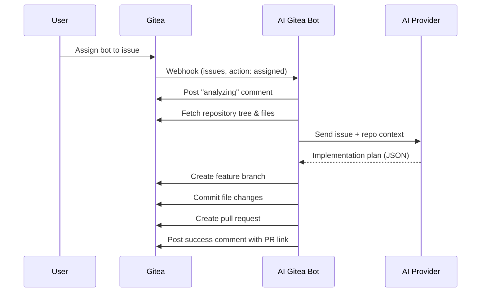

# Issue Implementation Agent

The AI Gitea Bot includes an **autonomous issue implementation agent** that can be assigned to Gitea issues. When assigned, the agent analyzes the issue description, generates an implementation plan using AI, and automatically creates a pull request with the proposed changes.

## How It Works



1. A user assigns the bot's Gitea user account to an issue
2. Gitea sends an `issues` webhook with `action: "assigned"`
3. The bot posts a progress comment on the issue
4. The bot fetches the repository file tree and relevant file contents
5. The bot sends the issue description and repository context to the AI provider
6. The AI responds with a structured implementation plan (JSON with file changes)
7. The bot creates a feature branch, commits the changes, and opens a pull request
8. The bot posts a summary comment on the issue linking to the PR

## Setup

### 1. Enable the Agent

Set the following environment variable (or application property):

```bash
export AGENT_ENABLED=true
```

### 2. Configure Gitea Webhooks

In addition to the existing webhook events (Pull Request, Issue Comment, etc.), enable the **Issues** event type in your Gitea webhook configuration:

- Go to **Settings → Webhooks → Edit**
- Check **Issues** under "Custom Events"
- Save

### 3. Required Gitea Permissions

The bot's API token needs **write** access to:
- **Repository**: Create branches, commit files, create pull requests
- **Issues**: Post comments on issues

Ensure the bot user has at minimum **Write** permission on the target repositories.

### 4. Optional Configuration

| Environment Variable | Property | Default | Description |
|---|---|---|---|
| `AGENT_ENABLED` | `agent.enabled` | `false` | Enable/disable the agent feature |
| `AGENT_MAX_FILES` | `agent.max-files` | `10` | Maximum files the agent can modify per issue |
| `AGENT_BRANCH_PREFIX` | `agent.branch-prefix` | `ai-agent/` | Prefix for created branches |
| `AGENT_ALLOWED_REPOS` | `agent.allowed-repos` | *(empty = all)* | Comma-separated list of `owner/repo` where agent is active |

### Example Docker Compose

```yaml
services:
  app:
    image: ai-gitea-bot:latest
    environment:
      GITEA_URL: https://your-gitea-instance.com
      GITEA_TOKEN: your-gitea-api-token
      AI_PROVIDER: anthropic
      AI_ANTHROPIC_API_KEY: your-api-key
      BOT_USERNAME: ai_bot
      AGENT_ENABLED: "true"
      AGENT_MAX_FILES: "10"
      AGENT_BRANCH_PREFIX: "ai-agent/"
      # AGENT_ALLOWED_REPOS: "myorg/repo1,myorg/repo2"
```

## Security Considerations

1. **No auto-merge**: The agent creates a pull request but never merges it. A human must review and approve all changes.
2. **Repository whitelist**: Use `agent.allowed-repos` to restrict which repositories the agent can operate on.
3. **File limit**: The `agent.max-files` setting prevents the agent from making overly large changes.
4. **Prompt injection protection**: The agent prompt includes guardrails against prompt injection from issue descriptions.
5. **Branch cleanup**: If the agent fails during implementation, it cleans up the created branch automatically.
6. **Feature toggle**: The agent is disabled by default (`agent.enabled=false`). It must be explicitly enabled.

## Limitations

1. **Context window limits**: Large repositories may exceed the AI provider's context window. The agent limits the number of files sent as context and truncates content when necessary.
2. **Complex multi-file changes**: The agent works best for focused, well-described issues. Very complex issues requiring changes across many files may produce incomplete or incorrect implementations.
3. **No test execution**: The agent does not run tests or build the project. The generated code should be reviewed and tested by a human.
4. **Single-turn implementation**: The current implementation generates changes in a single AI call. Future versions may support iterative refinement (plan → implement → review → refine).
5. **No dependency management**: The agent cannot add new project dependencies (e.g., Maven/Gradle dependencies).

## Error Handling

- If the agent fails at any point during implementation, it:
  - Deletes the created branch (if one was created)
  - Posts a failure comment on the issue with the error message
- If the AI response cannot be parsed, the agent posts a comment explaining the failure
- If the number of file changes exceeds `agent.max-files`, the agent declines and suggests breaking the issue into smaller tasks

## Branch Naming

Branches created by the agent follow the pattern:

```
{branch-prefix}issue-{issue-number}
```

For example: `ai-agent/issue-42`
